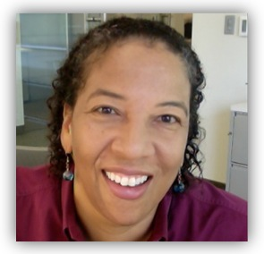

```{r setup, include=FALSE}
knitr::opts_chunk$set(echo = FALSE)
```

Join us for a conversation with Dr. Dawn Wright ([\@DeepSeaDawn](https://twitter.com/DeepSeaDawn)) about the connections between the open science movement, democratized tech, solution-driven science, and climate change. This conversation will launch our Openscapes Community Calls! It's all happening at MozFest, Mozilla's Internet Festival. Please register for MozFest here: <https://ti.to/Mozilla/mozilla-festival-2021>

<br> 

```{r, eval=FALSE, out.width="25%", out.extra='style="background-color: gray; padding:2px; display: inline-block;"', preview=TRUE}
  
```

<br> 

