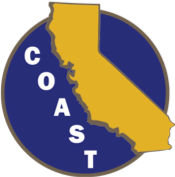

```{r setup, include=FALSE}
knitr::opts_chunk$set(echo = FALSE)
```

**This is a professional development and leadership opportunity for COAST-affiliated research groups to explore open data science practices.**

[**Openscapes**](https://openscapes.org) helps research groups reimagine data analysis, develop modern skills that are of immediate value to them, and cultivate collaborative and inclusive research communities. [**The Council on Ocean Affairs, Science & Technology (COAST)**](https://www2.calstate.edu/impact-of-the-csu/research/coast) supports researchers and affiliates at California State Universities. 

**Openscapes Champions** is a professional development and leadership opportunity to explore open practices for data-driven science. This two-month remote program is not about teaching you to code. It is about changing your relationship with code and data, and cultivating a more collaborative and inclusive research group. You will participate as a team with others from your research group, learning how to reframe data analysis as a collaborative effort rather than an individual burden. You will be mentored to supercharge your research by leveraging open source tools (e.g. R/RStudio, GitHub) to make your research more efficient and your data analyses more reproducible. For more information and guidance about how to select your team, please visit [openscapes.org/champions](https://www.openscapes.org/champions/).

**Program Overview:** We will meet four times over two months, on alternating Fridays in 2021.

- **Dates: **May 7, May 21, June 4, June 18
- **Times: **12:00-1:30pm PST 
- **Where:** remotely, via Zoom
- **Who: **Cohort of 6-8 COAST lab groups. Each team consists of a team lead (faculty or PI) and up to 4 team members of your choice (graduate students, undergraduates, technicians, etc). 
- **Expected time commitment:** 5hrs/month for 2 months, which accounts for a 3 hours/month over Zoom, and the remaining time for collaborating with your research group in between calls.

**Nominate your team to participate**

Nominate your team by filling out this [Google Form](https://docs.google.com/forms/d/e/1FAIpQLSc7dY2GXvaV_dCmwMJte2uRTxT17GvaGB63k8I2J98IZ-fHQQ/viewform?usp=sf_link) by March 26, 2021. This opportunity is open only to those affiliated with CSU COAST. Please submit one nomination per team, preferably by the team lead (faculty, project manager. principal investigator, etc). We will confirm participation by early April 2021. 


<br> 

This opportunity is funded by [COAST](https://www2.calstate.edu/impact-of-the-csu/research/coast).

```{r, out.width="20%", preview=TRUE}
  
```

<br> 
