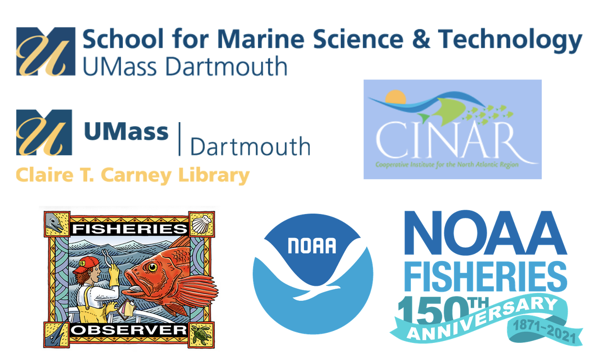

```{r setup, include=FALSE}
knitr::opts_chunk$set(echo = FALSE)
```


**This is a professional development and leadership opportunity for marine research groups to explore open data science practices.**

**Openscapes **helps research groups reimagine data analysis, develop modern skills that are of immediate value to them, and cultivate collaborative and inclusive research communities.

**[Openscapes](https://openscapes.org)** is an approach for doing better science in less time. We help research groups reimagine data analysis, develop modern skills that are of immediate value to them, and cultivate collaborative and inclusive research communities. This opportunity is funded through NOAA Fisheries Northeast Fisheries Science Center and a grant from the [Fisheries Information System Program](https://www.fisheries.noaa.gov/national/commercial-fishing/fisheries-information-system-program).

**Fishery Dependent Data (FDD) **represent a complex mix of information collected to facilitate managing the region's living marine resources. In the Northeast, data flow from individual businesses and/or scientific samplers to the region's scientific and management organizations. This web of information can be difficult to access as much of the content is confidential in its raw form. Further, many of the codes and systems used to store these data are poorly documented, and even routine analyses are not commonly shared among data users. Currently, FDD are therefore difficult to integrate into scientific advice for ecosystem based fisheries management. Analysts tend to be unfamiliar with the data or hesitant to explore their potential, and data can be viewed with skepticism rather than leveraged in new and innovative ways. There is a need to begin to provide access, documentation, and cultivate a community of practice that focuses on using these data to their full potential.

**Openscapes Champions** is a remote-by-design, cohort-based mentorship program that guides teams through the open data science landscape, empowers them as leaders, and welcomes them as part of the growing open community. This two-month remote program will help you establish shared, reproducible practices for data analysis that help make your research group more efficient and inclusive. You will participate with others from your research group as a team, as a cohort with your peers. Together, you will learn how to reframe data analysis as a collaborative effort rather than an individual burden, through exploring open data science tools and community practices (e.g. R/RStudio, GitHub). For more information and guidance about selecting your team, please visit [openscapes.org/champions](https://www.openscapes.org/champions/).

**Program Overview:** We will meet four times over two months, on alternating Fridays in 2021.

* **Dates: **Sep 17, Oct 1, Oct 15, Oct 29
* **Times: **12:00-1:30 pm EST 
* **Where:** remotely, via Zoom
* **Who: **Cohort of 7 FDD user teams (or lab groups). Each team consists of a team lead (PI, project supervisor, or faculty, etc) and up to 4 team members of your choice (analysts, technicians, students, postdocs, etc). 
* **Cost:** Free; this opportunity is sponsored by FDD through an award to [UMass Dartmouth-SMAST](https://www.umassd.edu/smast/) through [CINAR](http://www.cinar.org/).
* **Expected time commitment:** In addition to 3 hours/month over Zoom as a full Champions Cohort, participants will meet independently to further discuss topics with their research group. The minimum expected time commitment is 5hrs/month for 2 months.


**Nominate your team to participate**

Nominate your team by filling out this [Google Form](https://docs.google.com/forms/d/e/1FAIpQLSeUJUEqjRo0u4v5f8Ntv9qhDeGA6TkHmxlW1TjH0mg_3dDCDw/viewform?usp=sf_link) by August 20, 2021. This opportunity is open to those affiliated with teams using FDD in the Northeast US. Please submit one nomination per team, preferably by the team lead (faculty, project manager. principal investigator, etc). We will confirm participation by late August 2021. 

Learn more about the[ Openscapes Champions Program](https://openscapes.org/champions) and [FAQs about forming your team](https://openscapes.org/faq). Questions? Contact Openscapes: openscapes at nceas.ucsb.edu

```{r, out.width="80%", preview=TRUE}
  
```

