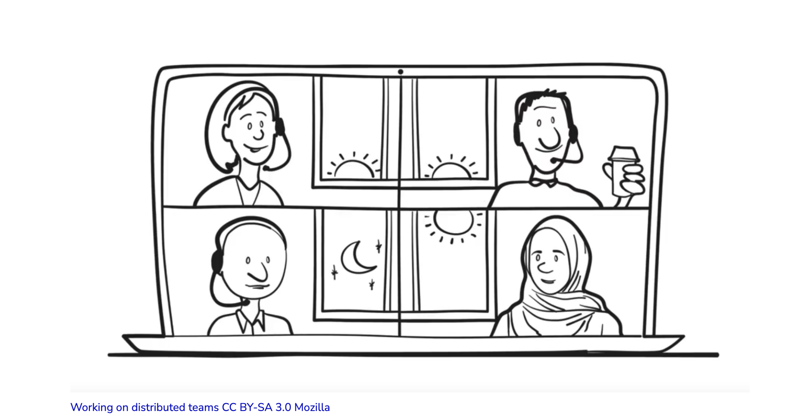

```{r setup, include=FALSE}
knitr::opts_chunk$set(echo = FALSE)
```

**Date: December 09, 2021**\
**Time: 10:00-11:00am PT** (UTC-7)\
**Where: Zoom**\
**Free event. Please register via [eventbrite](https://www.eventbrite.com/e/openscapes-community-call-on-open-leadership-tickets-200431906227)**

Please join us for a conversation with [Abby Cabunoc Mayes](https://twitter.com/abbycabs) and [Chad Sansing](https://twitter.com/chadsansing) of Mozilla about open leadership, the Mozilla Open Leaders program, and how it was designed and iterated. We'll discuss ideas and lessons learned from Moz OL, as well as from Openscapes, Open Life Science, Open Post Academics, and Open Hardware, and invite others to share as well!


```{r, out.width="45%", fig.align='center', preview=TRUE}
  
```

[**Abby Cabunoc Mayes**](http://acabunoc.github.io/) leads open source and AI programs at Mozilla, and is founder of Mozilla Open Leaders. She is making openness the norm in innovation and research.

[**Chad Sansing**](https://about.me/chadsansing) is program manager on the MozFest team at Mozilla, work on facilitation, leadership, and movement-building with our internet health and trustworthy AI communities. 
