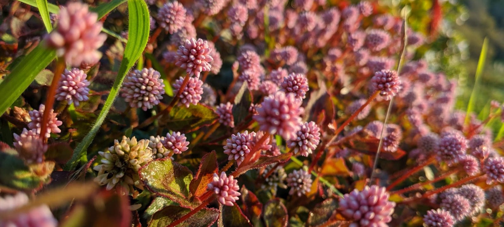

```{r setup, include=FALSE}
knitr::opts_chunk$set(echo = FALSE)
```

## Program overview

**This is a professional development and leadership opportunity for environmental and Earth research groups to develop open data science practices.**

**[Openscapes](https://openscapes.org)** is an approach for doing better science in less time[^1]. We help research groups reimagine data analysis, develop modern skills that are of immediate value to them, and cultivate collaborative and inclusive research communities. Openscapes’ mentorship and community engagement approaches center on open data science as kinder science[^2], enabling increased efficiency and resilience for teams so that their work has more enduring impact. 

**[Openscapes Champions](https://www.openscapes.org/champions/)** is a remote-by-design mentorship program for environmental and Earth science research teams to explore open data science practices. Participants attend as a team with their research group in a cohort with other teams, together learning how to reframe data-intensive science as a collaborative effort. By discussing open software tooling and communities enabling reproducible research (e.g. R/Python, GitHub, metadata), participants develop collaborative skills, mindsets, and habits and establish shared practices for increased efficiency in their own research, while contributing to a more inclusive scientific culture. 


```{r, out.width="50%", fig.align='center', preview=TRUE}
  
```


## Cohort details

**Our Cohort will meet five times over two months, on alternating Fridays.**

* **Dates:** May 6, 20, June 3, 17, July 1  2022
* **Times:** 11:30am-1:00pm Pacific Time
* **Where:** remotely, via Zoom
* **Who:** Cohort of 7 research teams. Each team consists of a team lead (PI, project supervisor, or faculty, etc) and up to 4 team members of your choice (analysts, technicians, students, postdocs, etc). 
* **Cost:** Free; this opportunity is supported by the Openscapes team.
* **Expected time commitment:** The minimum expected time commitment is 6hrs/month for 2 months. This includes 3 hours/month over Zoom as a full Champions Cohort, as well as teams meeting independently to further discuss topics between Cohort Calls. 

## Nominate your team to participate

Nominate your team by filling out this [Google Form](https://docs.google.com/forms/d/e/1FAIpQLScg85USS-QwSj8xa9hwBeJfXV-u971Z9DeOUZEunIA7rUamwA/viewform?usp=sf_link) by April 1, 2022. Please submit one nomination per team, preferably by the team lead (faculty, project manager. principal investigator, etc). We will confirm participation in early April 2022. 

Learn more about the [Openscapes Champions Program](https://openscapes.org/champions) and [FAQs about forming your team](https://openscapes.org/faq). Questions? Contact Openscapes: openscapes at nceas.ucsb.edu


[^1]:
     [nature.com/articles/s41559-017-0160](https://nature.com/articles/s41559-017-0160) 

[^2]:
     [blogs.scientificamerican.com/observations/open-software-means-kinder-science](https://blogs.scientificamerican.com/observations/open-software-means-kinder-science) 
