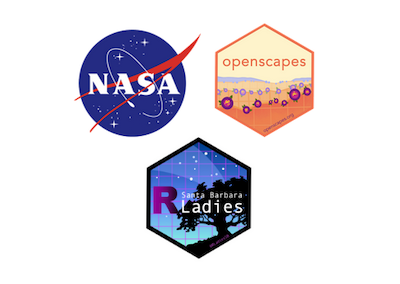

```{r setup, include=FALSE}
knitr::opts_chunk$set(echo = FALSE)
```

**Date: June 9, 2022**\
**Time: 3:30-5:00 PT** (UTC-7)\
**Where: Zoom**\
**Free event, [registration through eventbrite] (TODO)** <!---[**Video Recording**]() --->

Please join us for a chat about [Quarto](http://quarto.org/) - What is it? What does it look like? How do you use it, what can it do? How does it compare to RMarkdown? What does it mean for Python and Jupyter Notebooks? What about for open science, reproducibility, interoperability, and publishing?

Folks from [NASA Openscapes](https://nasa-openscapes.github.io) will share their experiences using Quarto to enable data-intensive open science on the cloud, in conversation with RLadies Santa Barbara. Following an hour of conversation, demoing, and community Q&A, we'll have another 20 minutes of informal chat and breakout rooms.

This event is co-hosted by [Openscapes](https://openscapes.org) and [RLadies Santa Barbara](https://twitter.com/RLadiesSB).


```{r, out.width="45%", fig.align='center', preview=TRUE}
  
```
